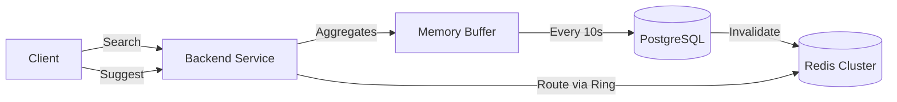

# Google-Style Distributed Search Typeahead

A high-performance, scalable search typeahead system designed to handle large datasets and massive search traffic. This implementation features advanced distributed systems concepts including **Consistent Hashing**, **Recency-Aware Ranking**, and **Asynchronous Batch Writing**.

## 🛠️ Technology Stack
*   **Backend**: Java 17, Spring Boot 3.2.6
*   **Persistent Storage**: PostgreSQL 15 (Docker)
*   **Distributed Cache**: Redis 7 (3 Independent Nodes)
*   **Frontend**: React 18, Vite 5, Vanilla CSS
*   **Architecture Helpers**: Lombok, Jackson, Lettuce (Redis Client), MD5 Hashing

## 📋 Prerequisites
*   **Docker & Docker Compose**: For Database and Cache infrastructure.
*   **Java 17+ (JDK)**: For the Spring Boot backend.
*   **Maven**: For building the backend.
*   **Node.js (18+)**: For building the frontend.

## 🚦 Setup Instructions

1.  **Start Infrastructure**:
    ```bash
    docker-compose up -d
    ```
    Starts PostgreSQL (`5432`) and 3 Redis nodes on ports `6379`, `6380`, and `6381`.

2.  **Run Backend**:
    ```bash
    cd backend
    mvn spring-boot:run
    ```
    The server starts on `http://localhost:8080`.

3.  **Run Frontend**:
    ```bash
    cd frontend
    npm install
    npm run dev
    ```
    The UI starts on `http://localhost:5173`.

---

## 📂 Dataset Management
*   **Data Source**: `backend/src/main/resources/data/queries_aggregated.csv`.
*   **Schema**: `query_text,search_count[,timestamp]`.
*   **Automatic Loading**: The `DatasetLoader` (implements `CommandLineRunner`) automatically populates the DB on the first boot.
*   **Smart Skip**: If the `queries` table contains data (`count > 0`), the loader will skip processing to avoid duplicates.
*   **Configuration**: Change the source file path in `application.properties` via `dataset.file.path`.

---

## 📡 API Documentation

| Method | Endpoint | Query Params / Body | Sample Response |
| :--- | :--- | :--- | :--- |
| `GET` | `/suggest` | `q=app&mode=trending` | `[{"query": "apple", "count": 1000}, ...]` |
| `POST`| `/search` | `{"query": "iphone"}`| `{"message": "Searched"}` |
| `GET` | `/batch/debug`| - | `{"totalSearchRequestsReceived": 1050, ...}` |
| `GET` | `/cache/debug`| `prefix=app` | `{"node": "redis-node-1", "port": 6379}` |

---

## 🏗️ System Architecture

### 1. Read Path (Suggestions)
When a user types, the system calculates the MD5 hash of the prefix and routes the request to one of the 3 Redis nodes using a **Consistent Hash Ring**. If a cache miss occurs, it fetches candidates from Postgres and re-ranks them based on the selected mode.

### 2. Write Path (Batching)
Search submissions are **not** written to the DB immediately. They are buffered in a thread-safe `ConcurrentHashMap`. Every **10 seconds** (or when the buffer hits 1000 items), a background task flushes the aggregated counts to PostgreSQL using a single atomic UPSERT and invalidates the prefix cache.



## 🚩 Project Status
*   ✅ **Core System**: Spring Boot + Postgres + CSV Loader
*   ✅ **Distributed Cache**: 3-node Redis cluster with Consistent Hashing
*   ✅ **Trending Logic**: Exponential time-decay ranking ($HL=12h$)
*   ✅ **Performance**: Aggregated Batch Writes (buffering)
*   ✅ **UI**: Google-style Responsive Frontend
