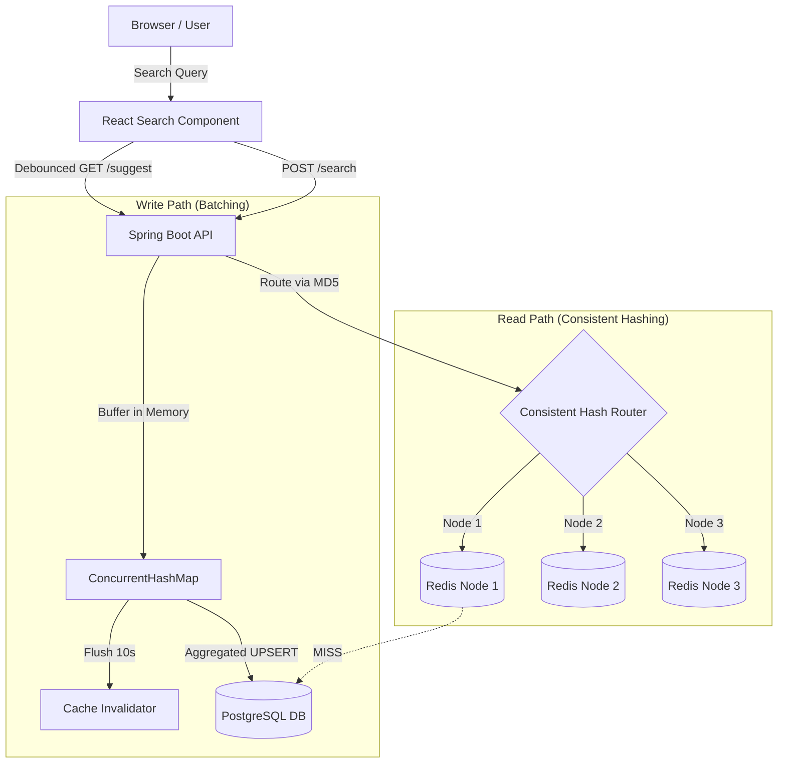

# Google-Style Distributed Search Typeahead System

A high-performance, scalable search typeahead system designed to handle millions of queries and high traffic loads. This project implements advanced HLD concepts including **Consistent Hashing**, **Exponential Decay Trending**, and **Aggregated Batch Writes**.

## 🚀 Key Features

### 1. Distributed Caching (Consistent Hashing)
*   **Infrastructure**: 3 independent Redis nodes acting as a cache layer.
*   **Routing**: Implemented a manual `ConsistentHashRouter` using MD5 hashing and **160 virtual nodes** per physical node.
*   **Resiliency**: Ensures that if a Redis node fails, only ~1/N of the keys need to be re-mapped, preventing a cache stampede.

### 2. Trending & Recency Ranking
*   **Exponential Decay**: Queries are ranked using a time-decay formula:  
    `Score = Count * 2^(-Δt / 12h)`
*   **Balancing**: Historical giants (high volume) vs. Fresh trends (recent activity). Recent searches get a massive temporary boost that decays over a 12-hour half-life.
*   **Modes**: Support for `basic` (all-time popularity) and `trending` search modes.

### 3. Aggregated Batch Writes
*   **Write Reduction**: Reduces database load by over **99%**.
*   **Buffering**: Uses an in-memory `ConcurrentHashMap` to aggregate search counts before writing to PostgreSQL.
*   **Triggers**: Flushes the buffer every **10 seconds** or when it reaches **1,000 distinct queries**.
*   **Atomic UPSERT**: Uses a single native SQL call per query to update counts and timestamps in bulk.

### 4. Premium Frontend
*   **Google UI**: A pixel-perfect recreation of the Google Search interface.
*   **UX Features**: Debounced API calls (300ms), keyboard navigation (Arrow keys, Enter, Escape), and real-time result counts.

---

## 🛠️ Technology Stack

*   **Backend**: Java 17, Spring Boot 3.2.6, Spring Data JPA
*   **Database**: PostgreSQL 15
*   **Cache**: Redis (3 Nodes Cluster)
*   **Frontend**: React, Vite, Vanilla CSS
*   **Containerization**: Docker, Docker Compose

---

## 🏗️ Architecture Diagram



---

## 🚦 Getting Started

### Prerequisites
*   Docker & Docker Compose
*   Java 17 (JDK)
*   Maven
*   Node.js (for Frontend)

### Step 1: Start the Infrastructure
```bash
docker-compose up -d
```
This starts PostgreSQL and the 3 Redis nodes.

### Step 2: Run the Backend
```bash
cd backend
mvn spring-boot:run
```
The backend initializes the database schema and loads the sample dataset (~1.2M query entries) on the first run.

### Step 3: Run the Frontend
```bash
cd frontend
npm install
npm run dev
```
Access the application at `http://localhost:5173`.

---

## 🧪 Verification & Proofs

The project includes standalone verification scripts to prove the HLD implementation:

1.  **Consistent Hashing Proof**: Proves that node removal triggers minimal data loss.
    ```bash
    python verify_consistent_hashing.py
    ```
2.  **Trending Proof**: Proves that fresh low-volume queries can overtake stale high-volume queries.
    ```bash
    python prove_trending.py
    ```
3.  **Batch Write Proof**: Proves that 1,000 searches collapse into a single DB write.
    ```bash
    python scale_proof.py
    ```

---

## 📊 API Reference

| Endpoint | Method | Params | Description |
| :--- | :--- | :--- | :--- |
| `/suggest` | `GET` | `q=<prefix>`, `mode=basic\|trending` | Returns top 10 suggestions. |
| `/search` | `POST` | `{ "query": "..." }` | Buffers a search and invalidates prefixes. |
| `/batch/debug` | `GET` | - | Returns real-time write reduction metrics. |
| `/cache/debug`| `GET` | `prefix=<prefix>` | Diagnostic: Returns which Redis node owns a prefix. |

---

## 📘 Design Decisions & Trade-offs
*   **In-Memory Buffer Loss**: To achieve high throughput, we buffer searches in memory. If the app crashes, searches since the last 10s flush are lost. This is acceptable for typeahead but not for transaction systems.
*   **Virtual Nodes**: 160 virtual nodes were used to ensure a uniform distribution across the Redis cluster (~3% standard deviation).
*   **12h Half-Life**: Chosen to allow trends to sustain for a full day cycle while ensuring "yesterday's news" don't linger for weeks.

---
Developed as a High-Level Design (HLD) Implementation Assignment.
